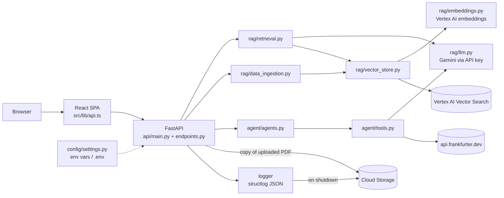

# Meridian AI

A small web app that does two jobs using AI:

1. **Ask questions about your documents.** Upload PDFs, then ask in plain English. The prompt tells the model to answer only from the retrieved passages and to say it does not know otherwise.
2. **Check a purchase before paying.** Paste a purchase request. Three AI "specialists" (risk, tax, financial control) review it, and a final "CFO" step writes one memo with a decision.

It is built to **learn from**. The company in the examples, *Aldermoor Industries*, is **fictional**, and the sample documents contain made-up data.

> The audit "checks" are produced by the AI from its general knowledge. Only the exchange-rate check uses a live data source (api.frankfurter.dev), with an AI estimate as a fallback. This is a demo of how such a system is built, **not** a real compliance tool.

**Verification status.** This README was rewritten from the code. Commands marked **verified** were run on Windows 11 PowerShell. Commands marked **not yet verified** are documented but have not been run, because Python 3.12 is not installed on the machine used. Evidence is in `docs/setup-log.md`.

**Jump to:** [Features](#features) · [Architecture](#architecture) · [Technology](#technology-stack) · [Prerequisites](#prerequisites) · [Quick start](#quick-start) · [Configuration](#configuration) · [Usage](#usage) · [Structure](#project-structure) · [Testing](#testing) · [Deployment](#deployment-and-cost) · [Troubleshooting](#troubleshooting) · [Contributing](#contributing)

---

## Features

All features below exist in the code.

| Feature | Where | Needs |
|---|---|---|
| Document Q&A with three retrieval strategies: `similarity` (3 chunks), `multiquery`, `contextual` (10 chunks, then trimmed) | `backend/rag/retrieval.py:26-48` | Google Cloud (Vector Search) + Gemini key |
| PDF upload: chunks of 1000 characters with 100 overlap, embedded and indexed | `backend/rag/data_ingestion.py:22-44` | Google Cloud |
| Bulk index of every PDF already in the bucket | `backend/rag/data_ingestion.py:47-73` | Google Cloud |
| Purchase audit: risk, tax and control agents run one after another, then a CFO memo | `backend/agent/agents.py:37-84` | Gemini key only |
| Five audit tools: sanctions screen, vendor credit score, cross-border tax, FX hedge check, CapEx/OpEx classification | `backend/agent/tools.py` | Gemini key (FX also calls api.frankfurter.dev) |
| Health and status endpoints | `backend/api/endpoints.py:50-90` | Nothing |
| React components for Q&A, document upload, audit and system status (how they are arranged into tabs in `pages/Index.tsx` was not read) | `frontend/src/components/` | Backend running |
| JSON logging, uploaded to Cloud Storage on shutdown when a bucket is set | `backend/logger/custom_logger.py` | Optional |

**Not in the code:** user accounts or authentication, a database, background jobs, queues, or per-user document separation.

## Architecture



Package dependencies point one way: `api` uses `rag` and `agent`; `agent` uses `rag.llm`; `rag` and `agent` use `config` and `logger`; `logger` uses `config`.

**Ask a question:** the page sends `POST /api/rag/ask`. The backend embeds the question, Vector Search returns the closest chunks, and Gemini answers from them.

**Run an audit:** `POST /api/agent/audit` runs the risk, tax and control agents in order. Each decides which tools to call. Then one plain Gemini call writes the memo. An audit makes roughly 11 or more Gemini calls (inferred from the code, not measured).

In Docker, one server serves both the API and the built web page on port 8080 (`backend/api/main.py:60-73`, `Dockerfile`).

## Technology stack

| Technology | Role | Version |
|---|---|---|
| Python | Backend language | 3.12 (`requirements.txt` says "Tested with Python 3.12") |
| FastAPI / uvicorn | Web API | 0.135.1 / 0.41.0 |
| Pydantic / pydantic-settings | Request validation and settings | 2.12.5 / 2.15.0 |
| LangChain (`langchain`, `-core`, `-classic`, `-community`, `-text-splitters`) | Agents, retrieval chain, PDF loading | 1.2.11 / 1.2.18 / 1.0.2 / 0.4.1 / 1.1.1 |
| langchain-google-genai | Gemini chat model (API key) | 4.2.1 |
| langchain-google-vertexai | Vertex AI embeddings and Vector Search | 3.2.2 |
| langgraph | Engine behind `create_agent` (no graph code written here) | 1.1.6 |
| google-cloud-aiplatform / google-cloud-storage | Google Cloud clients | 1.141.0 / 3.9.0 |
| pypdf | PDF reading | 6.7.5 |
| structlog | JSON logging | 26.1.0 |
| React / Vite / TypeScript | Frontend | React ^18.3.1, Vite 5.4.21 (built), TypeScript ^5.8.3 |
| Tailwind CSS, shadcn/ui (Radix) | Styling and components | Tailwind ^3.4.17 |
| Vitest, ESLint, Playwright | Frontend test and lint tools | vitest 3.2.4 |
| Docker, Cloud Run, Secret Manager, GitHub Actions | Packaging and deployment | see [Deployment](#deployment-and-cost) |

Backend versions are pinned in `requirements.txt`. Whether all pinned versions install together is **not yet verified**. Frontend dependencies use `^` ranges with `package-lock.json`.

## Prerequisites

| For | You need | Status on the machine used |
|---|---|---|
| Backend | **Python 3.12** (not enforced by the repo) | Not installed |
| Frontend | **Node 20+** (the Dockerfile builds with Node 20) | Verified on Node v25.5.0, npm 11.10.0 |
| Everything | Git | 2.52.0 |
| Audit feature | A Gemini API key (link taken from the original README, not checked: https://aistudio.google.com/apikey) | Not used yet |
| Document Q&A | A Google Cloud project with a Vector Search index and endpoint ([DEPLOY.md](DEPLOY.md)) | Not used |
| Docker run | Docker | 29.2.0 present; build not run |

## Quick start

Run backend commands from the repository root. Settings read `.env` from the current directory.

### Frontend (verified on Windows PowerShell)

```powershell
cd frontend
npm ci          # installs 498 packages from package-lock.json
npm test        # vitest: 1 test passes
npm run build   # writes frontend/dist
```

`npm run lint` currently **fails** (9 errors, 7 warnings in existing code). `npm ci` reports 33 audit findings; nothing has been upgraded.

### Backend (documented, not yet verified)

```powershell
python -m venv .venv
.venv\Scripts\Activate.ps1
pip install -r requirements-dev.txt
copy .env.example .env          # then edit .env and set GOOGLE_API_KEY
uvicorn api.main:app --app-dir backend --reload --port 8080
```

Then open **http://localhost:8080/docs** (the API docs FastAPI generates). `GET /api/health` should return `{"status": "ok"}` even with no `.env`, because clients connect lazily on first use (INFERRED from the code at `backend/rag/llm.py:12` and `backend/api/endpoints.py:41`; not run).

### Run the web page in development (not yet verified)

```powershell
cd frontend
npm run dev     # serves on http://localhost:3000
```

In development the page calls `http://localhost:8080` unless `VITE_API_URL` is set (`frontend/src/lib/api.ts:5`).

### Docker (not yet verified)

```powershell
docker build -t meridian-ai .
docker run -p 8080:8080 --env-file .env meridian-ai
```

`--env-file .env` puts your secrets into the container. The image does not contain `.env` (`.dockerignore`).

## Configuration

Settings are read from environment variables, then from `.env` in the current directory (`backend/config/settings.py:31-35`). Never commit `.env` (it is git-ignored). Use placeholders like these, never real values.

| Variable | Required? | Purpose | Example placeholder |
|---|---|---|---|
| `GOOGLE_API_KEY` | Required for audit and Q&A answers | Gemini API key | `<your-gemini-api-key>` |
| `GCP_PROJECT_ID` | Required for Q&A and uploads | Google Cloud project | `<your-gcp-project-id>` |
| `GCP_REGION` | Required for Q&A | Region of Vertex AI resources | `us-central1` |
| `GCS_BUCKET_NAME` | Required for Q&A and uploads | Bucket for uploads, index staging and logs | `<your-bucket-name>` |
| `GCS_PREFIX` | Optional (code default empty) | Folder for uploads; keep the trailing `/` | `uploads/` |
| `VECTOR_SEARCH_INDEX_ID` | Required for Q&A | Vector Search index ID | `<your-index-id>` |
| `VECTOR_SEARCH_INDEX_ENDPOINT_ID` | Required for Q&A | Vector Search endpoint ID | `<your-endpoint-id>` |
| `GCP_SERVICE_ACCOUNT_PATH` | Optional | Path to a key file; sets `GOOGLE_APPLICATION_CREDENTIALS` if the file exists | `<path-to-key.json>` |
| `VERTEX_LLM_MODEL_NAME` | Optional | Gemini model. Default `gemini-3.8-flash` is **not verified to exist** | `<current-gemini-model>` |
| `VERTEX_EMBEDDING_MODEL_NAME` | Optional | Embedding model; must output 768 dimensions. Default `text-embedding-005` | `text-embedding-005` |
| `LLM_TEMPERATURE` | Optional | `0` gives the most repeatable answers (default `0`) | `0` |
| `ENVIRONMENT` | Optional | Read into settings but not used by any code | `local` |
| `PORT` | Docker only | Port the container listens on (default 8080) | `8080` |
| `VITE_API_URL` | Optional, frontend build | Backend URL the page calls (set it if the backend is not on port 8080) | `http://localhost:8080` |

There are no settings for log level or log folder; they are fixed in code (INFO, `./logs`).

## Usage

All examples are **not yet run**. Audit and Q&A calls use Google services and can cost money or hit rate limits.

**Health and status (free, local):**
```powershell
Invoke-RestMethod http://localhost:8080/api/health
Invoke-RestMethod http://localhost:8080/api/status
```

**Audit (needs `GOOGLE_API_KEY`; sends the text to Google; allow a minute or more):**
```powershell
$body = '{"request_text": "Purchase of 200 PLC controllers from Takumi Controls Europe B.V. (Netherlands). Total 480,000 EUR. Origin JP, destination DE. FX rate quoted: 1 EUR = 163.5 JPY."}'
Invoke-RestMethod -Method Post -Uri http://localhost:8080/api/agent/audit -ContentType "application/json" -Body $body
```
The reply has `risk_result`, `tax_result`, `control_result` and `cfo_memo`. Wording varies between runs.

**Index documents (needs Google Cloud):**
```powershell
curl.exe -F "files=@sample_docs/aldermoor_procurement_policy.pdf" http://localhost:8080/api/rag/upload
Invoke-RestMethod -Method Post -Uri http://localhost:8080/api/rag/ingest-gcs
```
(`curl.exe` being present on your machine is NOT VERIFIED; the upload field name `files` comes from `backend/api/endpoints.py:123`.)

**Ask a question (needs Google Cloud and documents indexed):**
```powershell
Invoke-RestMethod -Method Post -Uri http://localhost:8080/api/rag/ask -ContentType "application/json" -Body '{"query": "What are the standard payment terms for servo motor suppliers?", "retriever_type": "similarity"}'
```
`retriever_type` is `similarity` (default), `multiquery` or `contextual`; any other value falls back to `similarity`.

**Other routes:** `GET /api/rag/uploads` lists uploads from the current session (kept in memory, lost on restart).

**Script:** from the `backend` folder, `python -m agent.agents` runs a built-in sample audit and prints the memo.

## Project structure

```
backend/
├── api/            main.py (app wiring, CORS, serves the built frontend), endpoints.py (routes), schemas.py
├── rag/            llm.py, embeddings.py, vector_store.py, data_ingestion.py, retrieval.py
├── agent/          agents.py (supervisor), tools.py (5 tools), prompts.py
├── config/         settings.py (environment settings)
├── logger/         custom_logger.py (JSON logs, upload to GCS on exit)
└── tests/          conftest.py (fake env), test_api.py
frontend/           React + TypeScript + Vite; src/lib/api.ts is the only backend client
sample_docs/        Four fictional PDFs
docs/               Discovery notes and setup-log.md
.github/workflows/  deploy.yml
Dockerfile, requirements.txt, requirements-dev.txt, .env.example, DEPLOY.md
```

## Testing

Backend (not yet run on this machine):
```powershell
pytest backend/tests
```
`test_api.py` contains 9 tests (health, status, 404, ask, audit, non-PDF upload, chunking, sample PDFs, log severity). They fake all external calls and need no accounts or network. Run them in a shell without `GCP_PROJECT_ID` set, because one test expects the fake value `test-project`. They do not exercise Gemini, Vector Search, Cloud Storage or document ingestion.

Frontend (verified): `cd frontend; npm test` passes 1 test. `npm run lint` currently fails.

## Deployment and cost

`.github/workflows/deploy.yml` runs on **every push to `main`** (and manually). If its GitHub secrets are set, it:
- creates a Vector Search index and endpoint, **billed by the hour even when idle**;
- stores your Gemini key in Secret Manager;
- deploys a **public Cloud Run service with no login** (anyone with the URL can use your Gemini quota and upload files).

Read [DEPLOY.md](DEPLOY.md) first: it explains costs, budget alerts and how to switch everything off. Work on other branches if you do not want to deploy. The workflow has no test step.

## Troubleshooting

| What you see | What to do |
|---|---|
| `python` or `py` not found | Python 3.12 is not installed; install it first |
| `ModuleNotFoundError: No module named 'api'` | Run from the repo root and keep `--app-dir backend` |
| Settings seem empty | Run from the repo root; `.env` is looked up in the current directory |
| AI features fail with auth or "model not found" errors | Check `GOOGLE_API_KEY`; set `VERTEX_LLM_MODEL_NAME` to a current model (default not verified) |
| Q&A returns 500 | Index ID, endpoint ID, project, region or bucket are unset or wrong; a 403 usually means the wrong account or key (see the troubleshooting table in `DEPLOY.md:211`; not reproduced here) |
| Audit returns text saying "Manual review required" | A tool's AI call failed and the tool degraded instead of raising; check the logs |
| Port already in use | Stop the other program, or use `--port 8081` and set `VITE_API_URL` |
| Page shows "Failed to fetch" | The backend is not running, or `VITE_API_URL` points to the wrong address |
| PowerShell shows `NativeCommandError` for npm warnings | Check `$LASTEXITCODE`; the warnings are not failures |
| `npm run lint` fails | Known: existing code has 16 lint problems |

The backend logs one JSON line per event to the console and to `logs/<timestamp>.log`. These logs include full queries, answers and audit text, so treat them as sensitive.

## Contributing

- Work on a branch; do not push to `main` unless you intend to deploy.
- Keep changes small, one logical change per commit, and run the tests before and after.
- Never commit `.env`, keys or credentials; use placeholders in docs and examples.
- Follow the existing style: thin routes, `from logger import GLOBAL_LOGGER as log`, settings via `config.settings`, and tests with fakes (see `CLAUDE.md`).
- Do not upgrade dependencies without discussing it first.
- Record notable decisions and command results in `docs/setup-log.md`.

---

*Aldermoor Industries and all sample data are fictional.*
