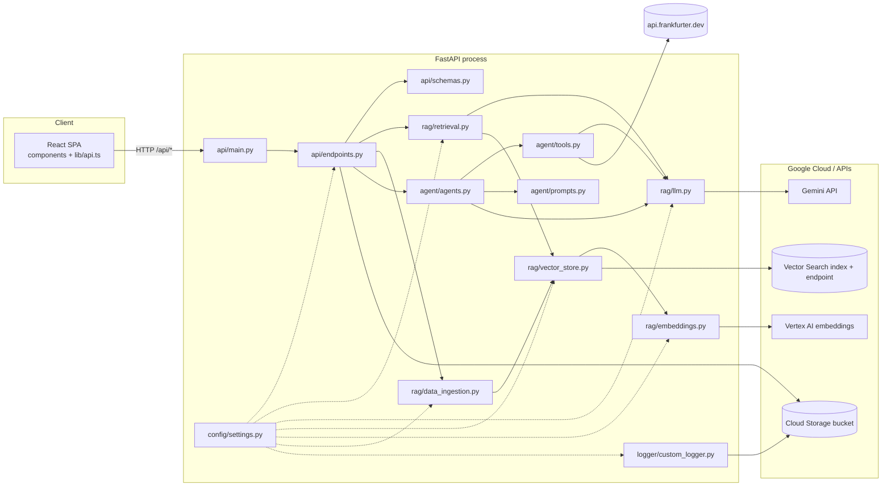
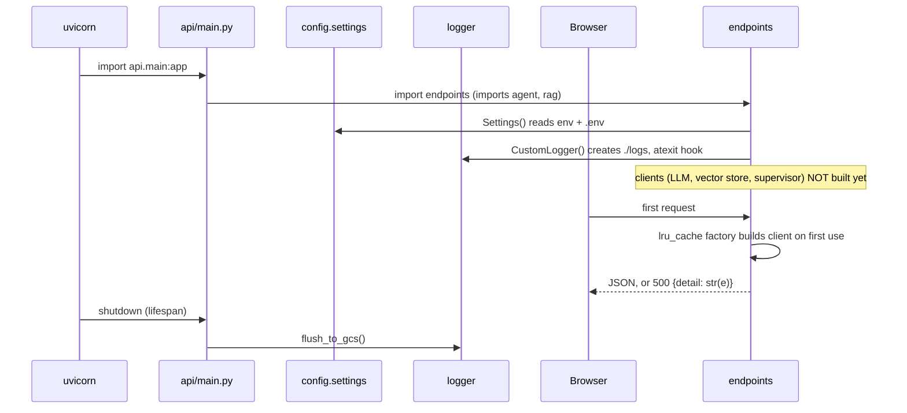
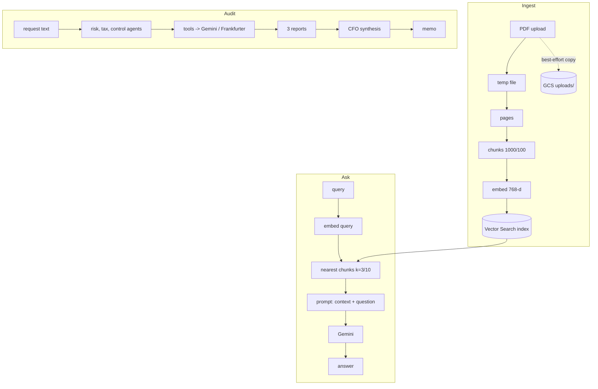
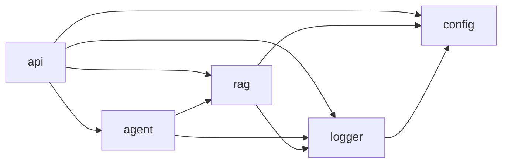
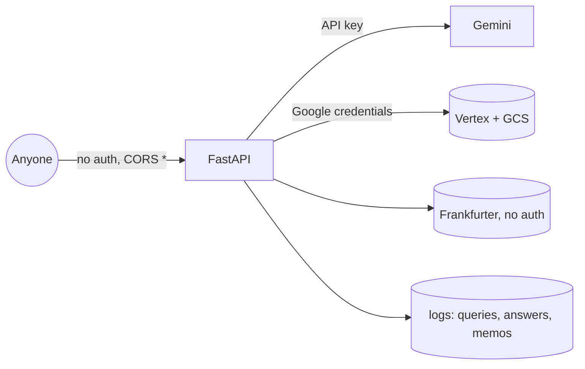
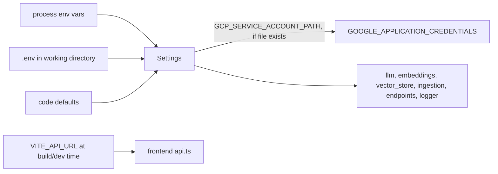
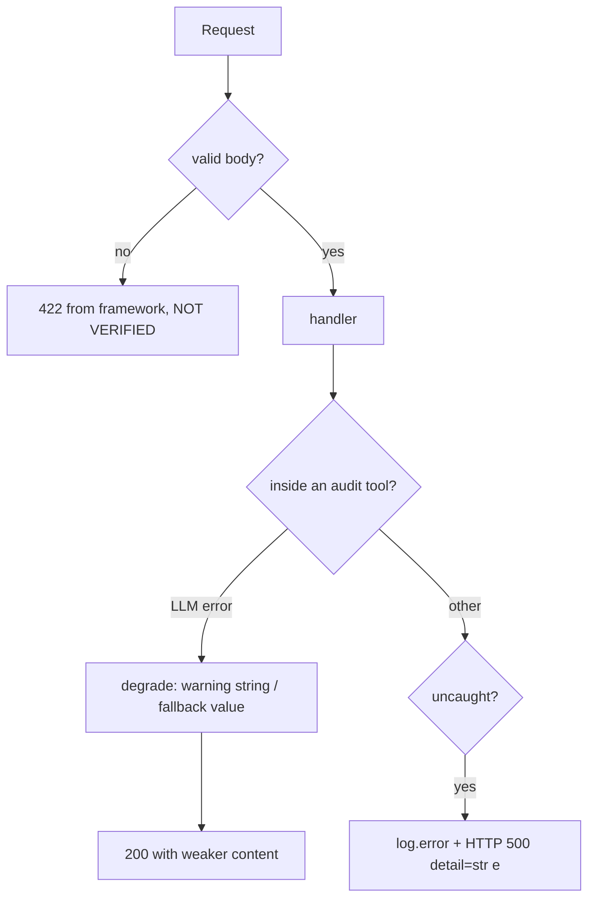
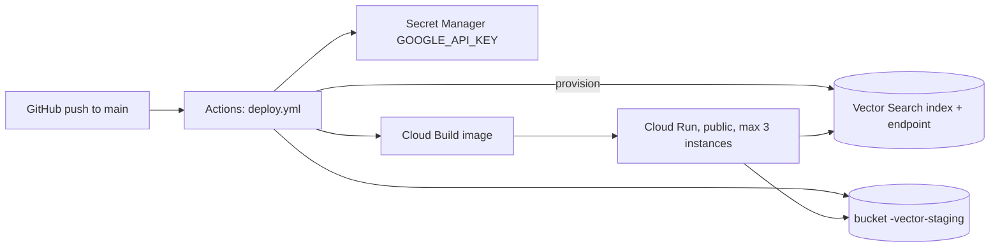

# ARCHITECTURE — Meridian AI

Derived from the code as read (nothing was run). Citations are `file:line`. **INFERRED** = intent reasoned from code, not stated. **NOT VERIFIED** = could not confirm (mostly library internals and anything that needs Google Cloud). Production deployment details are deferred to `docs/DEPLOYMENT.md` (not yet written); §11 only summarises what the repo defines.

## 1. System overview

A FastAPI backend (`backend/`) exposes REST endpoints for two features: document Q&A (RAG over Vertex AI Vector Search with Gemini) and a multi-agent purchase audit (LangChain agents calling Gemini). A React/Vite SPA (`frontend/`) calls those endpoints through one client file, `frontend/src/lib/api.ts`. When `frontend/dist` exists (after `npm run build`, as in Docker), the same FastAPI process also serves the SPA (`backend/api/main.py:60-73`). There is no database, queue, cache server or authentication; state lives in Google Cloud (index, bucket) and in process memory.

## 2. Component diagram

## 3. Module responsibilities

| Module | Responsibility | Evidence |
|---|---|---|
| `api/main.py` | Create app, CORS (all origins), include routers, serve SPA, flush logs at shutdown | `main.py:35-53,29-32,60-75` |
| `api/endpoints.py` | Seven routes; validate, delegate, map exceptions to HTTP 500; holds `_upload_history` | `endpoints.py:50-193`, `:36` |
| `api/schemas.py` | `AuditRequest/Response`, `QueryRequest/Response` | `schemas.py:10-30` |
| `rag/llm.py` | Cached Gemini chat model (API key); `extract_text` flattens content blocks | `llm.py:11-32` |
| `rag/embeddings.py` | Cached `VertexAIEmbeddings` (768-d model required) | `embeddings.py:15-17` |
| `rag/vector_store.py` | Cached `VectorSearchVectorStore` | `vector_store.py:11-24` |
| `rag/data_ingestion.py` | PDF to chunks to index; bulk ingest from bucket | `data_ingestion.py:26-73` |
| `rag/retrieval.py` | Retriever strategies and the RAG chain | `retrieval.py:26-67` |
| `agent/agents.py` | `ProcurementSupervisor`: 3 agents sequentially + synthesis | `agents.py:37-84` |
| `agent/tools.py` | Five tools; four are Gemini prompts, FX also calls a live API | `tools.py:28-269` |
| `agent/prompts.py` | Agent system prompts and the CFO template | `prompts.py:18,53,92,140` |
| `config/settings.py` | `Settings` singleton from env / `.env` | `settings.py:6-37` |
| `logger/` | structlog JSON to console and file; GCS upload on exit | `custom_logger.py:22-105` |

## 4. Runtime flow

Lazy construction is stated in `vector_store.py:12`, `endpoints.py:41`, `llm.py:12`. Sync route handlers run in a worker thread — INFERRED from FastAPI behaviour (NOT VERIFIED).

## 5. Data flow

Where chunk text is stored inside Vector Search or GCS: NOT VERIFIED (library behaviour).

## 6. Dependency relationships

Counted from `import` lines in `backend/`: `config.settings` has 7 importers, `logger` 6; `api/endpoints.py` imports 6 internal modules. No circular imports found. A latent cycle would appear if `config/settings.py:4` (commented out) were enabled. `agent` depends on `rag.llm` (`agents.py:29`, `tools.py:5`) and `api` imports `google.cloud.storage` directly (`endpoints.py:21`), both of which blur the layering described in the old README.

## 7. External integrations

| System | Used for | Auth | Config names |
|---|---|---|---|
| Gemini API | chat, agents, tools | API key | `GOOGLE_API_KEY`, `VERTEX_LLM_MODEL_NAME`, `LLM_TEMPERATURE` |
| Vertex AI embeddings | text to 768-d vectors | Google credentials (ADC, INFERRED) | `VERTEX_EMBEDDING_MODEL_NAME`, `GCP_PROJECT_ID`, `GCP_REGION` |
| Vertex AI Vector Search | vector store | Google credentials | `VECTOR_SEARCH_INDEX_ID`, `VECTOR_SEARCH_INDEX_ENDPOINT_ID` |
| Cloud Storage | uploads, staging, logs | Google credentials | `GCS_BUCKET_NAME`, `GCS_PREFIX` |
| api.frankfurter.dev | live FX rate (10 s timeout) | none | none |

## 8. Security boundaries

- No authentication or authorization on any route (`endpoints.py`); CORS allows every origin with credentials (`main.py:42-48`).
- The deploy workflow makes the service public (`deploy.yml:232,250-254`).
- `/api/status` exposes project, region, bucket and index IDs (`endpoints.py:69-81`).
- Uploads: extension check only, no size limit, client filename used in the object name (`endpoints.py:133,144,149`).
- Logs contain full queries, answers and audit text (`retrieval.py:53,66`; `agents.py:59-77`) and are uploaded to the document bucket (`custom_logger.py:96`).
- Secrets: the API key is read from env / `.env`; `.env` is git-ignored (`.gitignore:142,227`) and excluded from the image (`.dockerignore:7-8`).
- User and model text is interpolated into prompts (`tools.py:42,67`) — prompt-injection surface, INFERRED.

## 9. Configuration flow

`settings.py:31-35` (`.env` is a relative path), `:42-47` (credentials side effect). Precedence env > `.env` > defaults is INFERRED from pydantic-settings defaults. Env var names differ from attribute names (e.g. `GCP_PROJECT_ID` is `settings.GCP_PROJECT`, `settings.py:15`). `ENVIRONMENT` and `debug` have no readers in `backend/` (grep).

## 10. Error-handling flow

Details: tools return `LLM_ERROR` handling at `tools.py:18-19,56-57,94-95,152-153,209,262-268`; routes at `endpoints.py:103-105,117-119,169-171,192-193`; GCS copy failure only warns (`endpoints.py:152-153`); log flush failure only prints (`custom_logger.py:102-105`). No retries or backoff in repo code; library defaults NOT VERIFIED.

## 11. Current deployment architecture (as defined, never run)

From `deploy.yml:3-7,58-258` and `Dockerfile`: one container serves API and SPA; the workflow is idempotent provisioning (INFERRED intent). Whether it works end to end: NOT VERIFIED. See `docs/DEPLOYMENT.md` (to be written).

## 12. Known architectural concerns

1. No authentication on a public service (§8).
2. State is per process: `_upload_history` is lost on restart and differs across instances (`endpoints.py:36`; max 3 instances, `deploy.yml:234`).
3. Partial writes: multi-file upload failure leaves indexed files unrecorded (`endpoints.py:169-176`); GCS copy failure leaves vectors without originals (`:152-153`); re-ingest has no dedupe (INFERRED).
4. Audit conclusions come from LLM recall and prompt-following, not enforced code rules (`prompts.py:165-172`).
5. No timeouts/retries around Gemini and Google Cloud in repo code; synchronous, sequential audit (~11+ model calls, INFERRED).
6. One bucket serves uploads, index staging and logs (`deploy.yml:14,235`; `custom_logger.py:96`).
7. Embedding model, index dimension (768) and distance metric are coupled and fixed at index creation (`embeddings.py:3-6`, `deploy.yml:83-95`); changing the model needs a new index (INFERRED).
8. Deploy runs on every push to `main` with no test gate (`deploy.yml:3-7`).
9. Import-time side effects in `logger` (creates `./logs`, registers `atexit`) (`logger/__init__.py:5`, `custom_logger.py:25-36`).
10. `FX` tool mislabels LLM-estimated rates as "live market" (`tools.py:213`).
