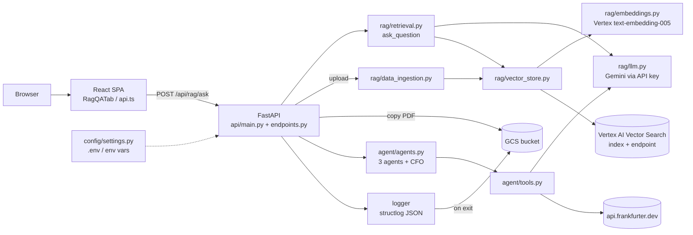

# PROJECT_DISCOVERY — Meridian AI (read-only discovery)

> **Note on `README.md:<line>` citations in this file:** they refer to the ORIGINAL README (commit `c2bbced`, 276 lines). `README.md` was rewritten afterwards, so its line numbers no longer match. View the original with `git show c2bbced:README.md`.

Status: **PROPOSAL / PLAN. Nothing in the repo has been changed, run, installed or built** except `.claude/settings.json` and files under `docs/`.
Evidence convention: `file:line` citations come from reading the code. **INFERRED** = reasoned from code, not observed. **NOT VERIFIED** = could not confirm without running or without access. No secret values were read; `.env` was never opened; `.env.example` was inspected for variable *names* only.

Not read in full (so claims about them are limited): `backend/agent/prompts.py` (only prompt names/placeholders grepped), `DEPLOY.md` (grepped), most `frontend/src` components, `frontend/src/components/ui/*`, `Project-runbook/*`.

---

## 1. Purpose
Meridian AI is a learning/demo web app with two features. (1) **Document Q&A (RAG):** upload PDFs, chunk and embed them into Vertex AI Vector Search, then ask questions answered by Gemini from retrieved chunks (`backend/rag/*`, `backend/api/endpoints.py:112-193`). (2) **Purchase audit:** three LangChain tool-using agents (risk, tax, financial control) run in sequence, then one plain LLM call writes a "CFO" memo (`backend/agent/agents.py:37-84`). A React/Vite SPA fronts both; in Docker the FastAPI server also serves the built SPA (`backend/api/main.py:60-73`). The company "Aldermoor Industries" and `sample_docs/` are fictional (README.md:3-10). Most audit "checks" are LLM recall, not real data sources; only the FX check calls a live API (`backend/agent/tools.py:28-269`).

## 2. Technology stack
| Layer | Technology | Source |
|---|---|---|
| Backend | Python **3.12** ("Tested with"), FastAPI 0.135.1, uvicorn 0.41.0, pydantic 2.12.5 / pydantic-settings 2.15.0, structlog | `requirements.txt:2-11`; `Dockerfile:12` |
| AI | LangChain 1.2.11 (`create_agent`), langchain-classic 1.0.2, langchain-google-genai 4.2.1 (Gemini by API key), langchain-google-vertexai 3.2.2 (embeddings + Vector Search), langgraph 1.1.6 (no direct import found — INFERRED transitive) | `requirements.txt:14-21`; `rag/llm.py:10-21` |
| Frontend | React 18, Vite 5, TypeScript 5.8, Tailwind 3, shadcn/ui (Radix), vitest, Playwright | `frontend/package.json` |
| Package managers | pip (venv), npm (`npm ci` in Docker). **Both `package-lock.json` and `bun.lock` exist.** | `Dockerfile:4-6`; `frontend/` listing |
| Runtimes | Python 3.12 (`python:3.12-slim`), Node 20 (`node:20-alpine`). No `engines`, `.python-version` or `.nvmrc` enforce them. | `Dockerfile:1,12`; README.md:145 |

## 3. Repository structure
- `backend/api/` — FastAPI app (`main.py`), routes (`endpoints.py`), request/response models (`schemas.py`).
- `backend/rag/` — `llm.py`, `embeddings.py`, `vector_store.py`, `data_ingestion.py`, `retrieval.py`.
- `backend/agent/` — `agents.py` (supervisor), `tools.py` (5 tools), `prompts.py`.
- `backend/config/settings.py` — pydantic-settings singleton. `backend/logger/` — structlog JSON + GCS flush.
- `backend/tests/` — `conftest.py`, `test_api.py` (9 test functions counted; **not run**).
- `frontend/` — Vite SPA; `src/lib/api.ts` is the only backend client; tabs in `src/components/`.
- `sample_docs/` — 4 fictional PDFs. `.github/workflows/deploy.yml` — provision + deploy. `Dockerfile`, `.dockerignore`, `generate_json.py` (CI helper), `DEPLOY.md`, `README.md`.
- `Project-runbook/` — runbooks/PDF; present on disk but listed in `.gitignore:31` (not tracked). Not analysed.

## 4. Entry points
- **API server:** `uvicorn api.main:app --app-dir backend --port 8080` (README.md:166; `Dockerfile:42` uses `${PORT:-8080}`). Routes: `GET /api/health`, `GET /api/status`, `POST /api/agent/audit`, `POST /api/rag/ask`, `POST /api/rag/upload`, `GET /api/rag/uploads`, `POST /api/rag/ingest-gcs` (`endpoints.py:50-193`). Catch-all SPA route only if `frontend/dist` exists (`main.py:62-73`).
- **UI:** `npm run dev` → port 3000 (`frontend/vite.config.ts` server.port); API base `VITE_API_URL` or `http://localhost:8080` in dev, same-origin in prod (`api.ts:5`).
- **Script:** `python -m agent.agents` from `backend/` (`agents.py:88-99`). `generate_json.py` (CI only, writes `init_embeddings.json` in cwd).
- **Scheduled/background jobs:** none found. Only `atexit` + lifespan-shutdown log flush to GCS (`custom_logger.py:36`, `main.py:29-32`) and `run_in_threadpool` for ingestion (`endpoints.py:156`).

### 4a. Primary flow traced: RAG question (`POST /api/rag/ask`)
1. `RagQATab.handleAsk` → `askQuestion` → `fetch POST /api/rag/ask {query, retriever_type}` (`RagQATab.tsx:25-41`, `api.ts:36-42`).
2. FastAPI validates `QueryRequest` (`schemas.py:25-27`; no length limit, `retriever_type` is free text) → `rag_query` (`endpoints.py:112-119`). No authentication/authorization anywhere.
3. `ask_question` (`retrieval.py:51-67`) logs the full query (`:53`), builds prompt, `create_stuff_documents_chain(get_llm(), prompt)`, `create_retrieval_chain(build_retriever(...))`, `invoke`. Chains are rebuilt per request; only `get_llm()` and `get_vector_store()` are `lru_cache`d (`llm.py:11`, `vector_store.py:11`).
4. `build_retriever` (`retrieval.py:26-48`): `similarity` k=3 (default, also fallback for unknown types), `multiquery` (extra LLM call), `contextual` (k=10 + one LLM extraction call per chunk).
5. `get_vector_store` → `aiplatform.init` + `VectorSearchVectorStore.from_components(... embedding=get_embeddings(), index_id, endpoint_id, gcs_bucket_name, stream_update=True)` (`vector_store.py:14-24`); query embedded by `VertexAIEmbeddings(model_name=...)` (`embeddings.py:17`) — **project/location not passed explicitly** (INFERRED: relies on ADC or the `aiplatform.init` globals).
6. Top chunks + question → Gemini via `ChatGoogleGenerativeAI` with `GOOGLE_API_KEY` (`llm.py:16-20`) → `response["answer"]` logged in full (`retrieval.py:66`) → `QueryResponse(answer=...)`.
7. Errors: any exception → `log.error` + `HTTPException(500, detail=str(e))` (`endpoints.py:117-119`), so internal error text reaches the client. Frontend shows `err.message` (`RagQATab.tsx:36-37`).

Ingestion path (`POST /api/rag/upload`, `endpoints.py:122-176`): `.pdf` extension check only → temp file → best-effort copy to GCS (`:147-153`, failure only warned) → `ingest_pdf` in threadpool (`data_ingestion.py:31-44`: `PyPDFLoader`, 1000/100 char splitter, `add_documents`) → results appended to an in-memory list lost on restart (`endpoints.py:36,175`).

Audit path (`POST /api/agent/audit`, `endpoints.py:97-105`): `get_supervisor()` (cached) → `run_audit` runs risk → tax → control agents sequentially, then synthesis (`agents.py:56-84`). Tools call Gemini with f-string prompts (`tools.py`); FX tool tries `https://api.frankfurter.dev` (timeout 10s) then LLM fallback (`tools.py:190-209`).



```mermaid
sequenceDiagram
  participant B as Browser (RagQATab)
  participant A as FastAPI /api/rag/ask
  participant R as retrieval.ask_question
  participant V as VectorSearchVectorStore
  participant E as Vertex Embeddings
  participant S as Vector Search endpoint
  participant G as Gemini API
  B->>A: POST {query, retriever_type}
  A->>R: ask_question(query, type)
  R->>R: log query; build prompt + chains
  R->>V: get_vector_store() (cached)
  R->>V: retriever.invoke(query)
  V->>E: embed query
  E-->>V: 768-d vector
  V->>S: nearest neighbours (k=3/10)
  S-->>V: datapoint ids
  V-->>R: Documents (text fetched from GCS staging, INFERRED)
  R->>G: stuffed prompt (context + question)
  G-->>R: answer
  R-->>A: answer (logged)
  A-->>B: {answer} or 500 {detail: str(e)}
```

### 4b. Ten files to read first
1. `backend/api/endpoints.py` — every route, error handling, upload path, in-memory state.
2. `backend/rag/retrieval.py` — the RAG chain and the three retriever strategies.
3. `backend/rag/vector_store.py` — how Vector Search is wired (index/endpoint/bucket ids).
4. `backend/rag/data_ingestion.py` — PDF → chunks → index; GCS bulk ingest.
5. `backend/config/settings.py` — every env var, aliases (names differ from attributes), credentials side effect.
6. `backend/agent/agents.py` — supervisor and the sequential agent flow.
7. `backend/agent/tools.py` — the five tools; mostly LLM recall, one live API.
8. `backend/api/main.py` — app wiring, wide-open CORS, SPA serving, shutdown log flush.
9. `.github/workflows/deploy.yml` — what a push to `main` provisions (paid, public).
10. `backend/logger/custom_logger.py` — import-time side effects and GCS log upload.
(Then `frontend/src/lib/api.ts`, `Dockerfile`, `backend/tests/test_api.py`, `DEPLOY.md`.)

## 5. Dependencies
- **Backend** (`requirements.txt`): all 15 direct deps are pinned with `==`; dev adds `pytest==8.4.2`, `httpx==0.28.1` (`requirements-dev.txt`). Unpinned: transitive deps (no lockfile/constraints) — builds are not fully reproducible. **NOT VERIFIED:** that every pinned version exists and resolves together under Python 3.12 (needs `pip`, which was not run).
- Apparently unused/indirect: `langgraph` (no direct import in files read, comment says engine behind `create_agent`, `requirements.txt:21`) — INFERRED; `pypdf` used indirectly by `PyPDFLoader`.
- **Frontend** (`package.json`): caret ranges everywhere (`^`), lockfiles present (two: `package-lock.json`, `bun.lock`). `jspdf` — no import found under `frontend/src` by grep (INFERRED unused). Many shadcn/ui components likely unused (INFERRED). Duplicate toast hooks: `src/hooks/use-toast.ts` and `src/components/ui/use-toast.ts`; both Radix toast and `sonner` present. `lovable-tagger` is a dev-only plugin (`vite.config.ts`). `package.json` name is the template `vite_react_shadcn_ts`.
- No upgrades were attempted or proposed here.

## 6. Configuration (names only)
Backend settings in `backend/config/settings.py` (class `Settings`; `.env` at **relative** path, `:31-35`, so the working directory matters):

| Env var | Attribute | Required for | Line |
|---|---|---|---|
| `GOOGLE_API_KEY` | `GOOGLE_API_KEY` | audit, RAG answer (Gemini) | 14 |
| `GCP_PROJECT_ID` | `GCP_PROJECT` | RAG, uploads, status | 15 |
| `GCP_REGION` | `GCP_REGION` | RAG | 16 |
| `GCS_BUCKET_NAME` | `GCS_BUCKET_NAME` | RAG, log upload | 17 |
| `GCS_PREFIX` | `GCS_PREFIX` | uploads (default empty!) | 18 |
| `GCP_SERVICE_ACCOUNT_PATH` | `gcp_service_account_path` | optional; sets `GOOGLE_APPLICATION_CREDENTIALS` | 19, 42-47 |
| `VERTEX_LLM_MODEL_NAME` | `llm_model_name` (default `gemini-3.8-flash`) | optional | 22 |
| `LLM_TEMPERATURE` | `llm_temperature` (0.0) | optional | 24 |
| `VERTEX_EMBEDDING_MODEL_NAME` | `embedding_model_name` (`text-embedding-005`) | optional | 26 |
| `VECTOR_SEARCH_INDEX_ID` / `VECTOR_SEARCH_INDEX_ENDPOINT_ID` | `vector_search_index_id` / `..._endpoint_id` | RAG | 28-29 |
| `ENVIRONMENT` | `app_env` | **defined but unused** (grep of `backend/`) | 9 |
| `PORT` | — | Docker CMD only | `Dockerfile:42` |
| `VITE_API_URL` | — | frontend build; **not in README or `.env.example`** | `api.ts:5` |

Also non-env fields `debug: bool = True` (`settings.py:11`) — unused in `backend/` (INFERRED dead). `.env.example` defines 12 names, matching the settings aliases above (names only inspected).
**Precedence (INFERRED from pydantic-settings defaults, not run):** process env vars override `.env`, which overrides code defaults. On Cloud Run, env vars come from `--set-env-vars` plus the `GOOGLE_API_KEY` secret (`deploy.yml:235-236`); `.env*` is excluded from the image (`.dockerignore:7-8`). README's Settings table (README.md:241-253) omits `ENVIRONMENT`.

## 7. External integrations
| System | Used for | Auth / config |
|---|---|---|
| Gemini API (`generativelanguage`) | chat, agents, tools | `GOOGLE_API_KEY` (`llm.py`) |
| Vertex AI embeddings | text → 768-d | ADC; `VERTEX_EMBEDDING_MODEL_NAME` |
| Vertex AI Vector Search | vector DB (STREAM_UPDATE, DOT_PRODUCT, 768 dims) | ADC; index/endpoint IDs (`deploy.yml:83-95`) |
| Cloud Storage | uploaded PDFs, index staging, logs | ADC; `GCS_BUCKET_NAME`, `GCS_PREFIX` — **one bucket** (`${project}-vector-staging`) serves uploads, staging and logs (`deploy.yml:14,235`; `custom_logger.py:96`) |
| Secret Manager, Cloud Run, Cloud Build | deploy | GitHub secrets: `GCP_PROJECT_ID`, `GCP_CREDENTIALS_JSON`, `GOOGLE_API_KEY` (`deploy.yml:10,30,197`) |
| api.frankfurter.dev | live FX rate | none (`tools.py:193`) |
No SQL database, queue, cache server or auth provider found.

## 8. Build and test tooling
- Tests: `pytest backend/tests` (README.md:205); `conftest.py` fakes env and blanks `GCS_BUCKET_NAME`. README claims "9 passed" — 9 test functions counted, **NOT VERIFIED (not run)**. Tests cover health/status/404/ask/audit/upload-skip/chunking/sample PDFs/severity field; none exercise real GCP, Gemini, or ingestion beyond chunking.
- Frontend: `npm run lint|test|build`; one `example.test.ts`; Playwright config/fixture present, no e2e specs seen (NOT VERIFIED).
- No Makefile, no Python linter/formatter/type-checker config, no pre-commit, no Terraform/IaC (deploy is shell in the workflow).
- CI: only `deploy.yml`; **no test or lint job**, deploy runs on every push to `main` (`deploy.yml:3-7`).

## 9. Deployment artifacts
- `Dockerfile`: stage 1 builds SPA (`npm ci`, `npm run build`); stage 2 `python:3.12-slim` + `build-essential`, installs `requirements.txt`, copies `backend/` and `frontend/dist`; runs as root; no `HEALTHCHECK` (`Dockerfile:1-42`).
- `deploy.yml`: enables 13 APIs + 90s sleep; creates bucket; runs `generate_json.py`; creates Vector Search index (~25-30 min), endpoint, deploys index (up to 45-min poll that only warns on timeout, `:175-178`); writes/updates Secret Manager secret; `gcloud builds submit`; `gcloud run deploy --allow-unauthenticated --max-instances 3`; grants `run.admin` to the deployer and `allUsers` `run.invoker` (`:226-258`). **Creates billed, always-on resources.**
- `DEPLOY.md`: costs, 3 secrets, teardown commands (grepped only; DEPLOY.md:172 itself warns the public URL has no login).

## 10. Initial risks
Security-sensitive (all `INFERRED` impact unless stated):
1. **No authentication/authorization on any endpoint**, public on Cloud Run (`deploy.yml:232,250-254`; confirmed by DEPLOY.md:172 warning). Anyone can burn Gemini quota, upload PDFs, trigger `ingest-gcs`.
2. **CORS `*` with `allow_credentials=True`** (`main.py:42-48`).
3. **Internal error text returned to clients** (`endpoints.py:105,119,171,193`).
4. **Unauthenticated `/api/status`** discloses project, region, bucket, index and endpoint IDs (`endpoints.py:69-81`).
5. **Upload hardening:** extension-only check, no size/type validation (`endpoints.py:133`); client filename used verbatim in the GCS object name (`:149`; the local path uses `basename`, `:142`).
6. **Logs hold full queries, answers and audit memos** (`retrieval.py:53,66`; `agents.py:59-77`) and are uploaded to the same bucket as user documents (`custom_logger.py:96`).
7. **Deploy identity:** long-lived JSON key in GitHub secrets (`deploy.yml:30`), `roles/run.admin` granted to deployer (`:245`), Secret Manager grant to the default compute SA (`:218`). Whether that SA has Vertex/GCS permissions at runtime is **NOT VERIFIED** (not granted in the workflow).
8. Prompt-injection surface: user text/RAG chunks and LLM-supplied tool arguments are interpolated into prompts (`tools.py:42,67`, `retrieval.py:22`). Audit conclusions are LLM recall, not authoritative (README.md:10).

Correctness / quality:
- `validate_fx_hedge` labels the rate "live market" whenever the pair parsed, even when the rate came from the LLM fallback (`tools.py:213`); no guard for `market_rate == 0` (`:212`).
- `GCS_PREFIX` default is empty (`settings.py:18`) and is concatenated without a separator (`endpoints.py:149`).
- `_upload_history` is lost on restart and not appended if a later file errors (`endpoints.py:36,169-176`).
- `api` layer imports `google.cloud.storage` directly (`endpoints.py:21,148`), contradicting the README's layering claim (README.md:131-135).
- Import-time side effects: importing `logger` creates `./logs` and configures logging (`logger/__init__.py:5`, `custom_logger.py:25-26`).
- Container runs as root with compiler toolchain in the final image.

## 11. Unknowns (ranked by how much they block running the project)
**Blocks any AI feature**
1. `GOOGLE_API_KEY` must be supplied (no value inspected); and the default model `gemini-3.8-flash` (`settings.py:22`, `deploy.yml:235`) — **NOT VERIFIED that it exists/is available** to your key. README admits model names get retired (README.md:255).
2. Pinned dependency set — **NOT VERIFIED installable** on this machine; no `python` on PATH in Git Bash (observed earlier); Python 3.12 availability unknown; README's activate commands are Linux-style (README.md:156-158).

**Blocks document Q&A (feature 1)**
3. Needs a provisioned, **paid, hourly-billed** Vertex Vector Search index + endpoint + bucket, plus ADC login or service-account file (DEPLOY.md:23-47). No local fallback exists. IDs unknown to me.
4. `VertexAIEmbeddings` is not given project/location (`embeddings.py:17`); correct behaviour depends on ADC/global init — NOT VERIFIED.
5. Index/embedding compatibility: index uses DOT_PRODUCT (`deploy.yml:86`); whether `text-embedding-005` output is normalized for that metric — NOT VERIFIED.
6. Whether IAM for the runtime identity is sufficient (see risk 7).

**Friction / ambiguity**
7. Must run from repo root (relative `.env`, `./logs`) (`settings.py:32`; README.md:179).
8. `VITE_API_URL` and `ENVIRONMENT` undocumented/unused; `debug` unused; contents of `prompts.py` not reviewed.
9. Two frontend lockfiles (npm vs bun) — which is canonical? Dockerfile uses npm.
10. No TODO/FIXME markers found in `backend/`, `frontend/src`, root `*.py`, workflow or Dockerfile (grep: 0 matches), so known-gap tracking lives only in prose.
11. Missing docs: no CONTRIBUTING, LICENSE, `.python-version`, `engines`, test-in-CI statement; README lacks a Windows-native run path and a note that `/api/status` is public.
12. `Project-runbook/` is untracked/ignored but sits in the tree — intent unknown.

## 12. Decisions needed from the owner
1. **Goal for this session:** run audit only (needs just `GOOGLE_API_KEY`), or also document Q&A (needs paid GCP)? Do you have a GCP project/budget alert, or should RAG be stubbed/mocked for local work?
2. **Python:** may I create a venv with Python 3.12 (installing it if absent) and `pip install -r requirements-dev.txt`? (This installs packages; I'll wait for approval.)
3. **Model name:** should I confirm `gemini-3.8-flash` against current Gemini docs/your key, and are you willing to change the default if it fails?
4. **Auth:** is the public, unauthenticated Cloud Run deployment intentional for a demo, or should auth/IAP/API key be added (architectural change — your call)?
5. **CI:** may I propose adding a test job and gating deploy on it, and changing the deploy trigger from every push to `main` (`deploy.yml:3-7`) to manual (`workflow_dispatch`) only?
6. **Logs/privacy:** should queries/answers/memos stop being logged or stored in the document bucket?
7. **Cleanup:** may I later propose removal of dead settings (`debug`, `app_env`), unused frontend deps/components, duplicate toast hooks, and one of the two lockfiles? (No action without approval.)
8. **`CLAUDE.md`:** keep my earlier README-derived draft, or revise it using this verified discovery? (Phase 3 plans to move the operating rules there.)
9. **Commits:** `CLAUDE.md` and `docs/` are untracked — commit them (separately), or leave local?
