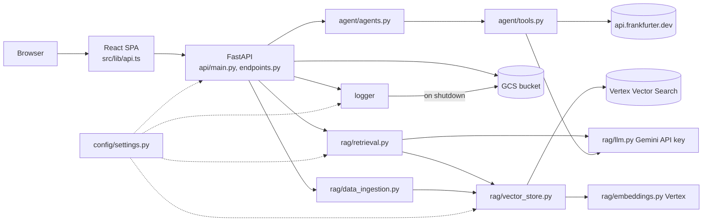
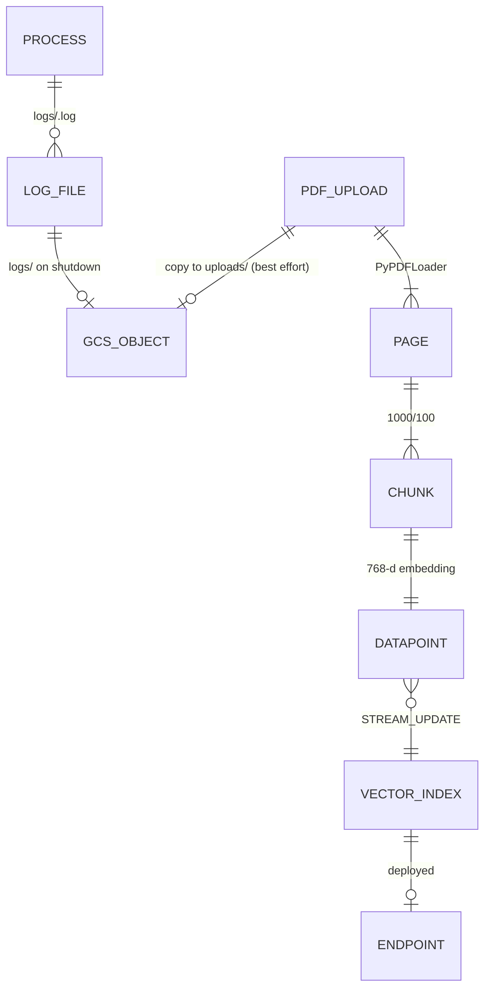

# UNDERSTANDING — Meridian AI

> **Note on `README.md:<line>` citations in this file:** they refer to the ORIGINAL README (commit `c2bbced`, 276 lines). `README.md` was rewritten afterwards, so its line numbers no longer match. View the original with `git show c2bbced:README.md`.

Built from code read during the read-only discovery sessions. Nothing was run. Every claim carries `file:line` (repo-relative), or is marked **INFERRED** (reasoned, not observed) or **NOT VERIFIED** (could not confirm). Third-party library internals (LangChain, LangGraph, FastAPI, Gemini/Vertex clients) were not read, so behaviour inside them is NOT VERIFIED. No secret values were read; `.env` was never opened.

---

## 1. Purpose and use cases

Meridian AI is a learning/demo app with a FastAPI backend and a React SPA (`README.md:3-10`). The company "Aldermoor Industries" and `sample_docs/` are fictional (`README.md:8`). Audit checks are mostly LLM recall, not real data sources; only the FX rate uses a live API (`README.md:10`, `backend/agent/tools.py:193`).

| # | Use case | Trigger | Inputs | Outputs | Success | Tests |
|---|---|---|---|---|---|---|
| 1 | Ask documents (RAG) | `RagQATab.tsx:25-41`; `POST /api/rag/ask` (`endpoints.py:112`) | `query`, `retriever_type` (`schemas.py:25-27`) | `{answer}` (`schemas.py:29-30`) | Grounded answer, or "don't know" (`retrieval.py:16-23`) | Route shape only, `ask_question` faked (`test_api.py:25-29`) |
| 2 | Index documents | Upload tab / `POST /api/rag/upload` (`endpoints.py:122`); `POST /api/rag/ingest-gcs` (`:185`) | PDF files | per-file `status` ingested/skipped, pages, chunks (`:134-168`) | `ingested` with chunks > 0 | Non-PDF skip, chunking, sample PDFs (`test_api.py:43-71`); nothing for GCS/Vector Search |
| 3 | Purchase audit | Audit tab (`AuditTab.tsx:49`); `POST /api/agent/audit` (`endpoints.py:97`); `python -m agent.agents` (`agents.py:88-99`) | `request_text` (`schemas.py:10-11`) | 4 texts (`schemas.py:13-17`) | All four non-empty | Route shape, supervisor faked (`test_api.py:32-40`) |
| 4 | Health / status | System Status tab (`SystemStatusTab.tsx:49`); `GET /api/health`, `/api/status` (`endpoints.py:50-90`) | none | status + config summary | HTTP 200 | Yes (`test_api.py:11-23`) |
| 5 | Operator: deploy | push to `main` or manual (`deploy.yml:3-7`) | GitHub secrets `GCP_PROJECT_ID`, `GCP_CREDENTIALS_JSON`, `GOOGLE_API_KEY` (`deploy.yml:10,30,197`) | bucket, index, endpoint, secret, Cloud Run service | `/api/health` on the service URL (NOT VERIFIED — never run) | None |

## 2. System map

Layer direction (from imports in `backend/`): `api → agent, rag, config, logger`; `agent → rag.llm, logger` (`agents.py:28-29`, `tools.py:5-6`); `rag → config, logger`; `logger → config` (`custom_logger.py:7`); `config → nothing internal`. No circular imports found. A latent cycle would appear if `settings.py:4` (commented-out logger import) were enabled. Most depended-on: `config.settings` (7 importers), `logger` (6). Largest fan-out: `api/endpoints.py` (6). Frontend import cycles: NOT VERIFIED (no tool run).

In Docker, one server serves API and SPA on one port (`main.py:60-73`, `Dockerfile:37-42`).

## 3. Use cases traced

### 3.1 Ask documents
1. `RagQATab.tsx:25-41` `handleAsk` → `api.ts:36-42` `askQuestion` → `fetch POST /api/rag/ask` (`api.ts:7-8`; base URL `api.ts:5`; no timeout).
2. CORS allows all (`main.py:42-48`). No authentication anywhere.
3. `endpoints.py:112-113` `rag_query`; body parsed to `QueryRequest` (`schemas.py:25-27`); framework dispatch NOT VERIFIED.
4. `retrieval.py:51-67` `ask_question`: logs full query (`:53`), builds prompt (`:55-58`), `create_stuff_documents_chain` (`:61`), `create_retrieval_chain(build_retriever(...))` (`:63`), `invoke` (`:65`). Chains are rebuilt per request.
5. `retrieval.py:26-48` `build_retriever`: `similarity` k=3 (`:48`), `multiquery` (`:41-45`), `contextual` k=10 + LLM extractor (`:36-40`); unknown type logs a warning and uses similarity (`:46-47`).
6. `vector_store.py:11-24` `get_vector_store` (cached): `aiplatform.init` (`:14`), `VectorSearchVectorStore.from_components(...stream_update=True)` (`:16-24`). Embeddings: `embeddings.py:15-17` (`VertexAIEmbeddings`, project/location not passed — INFERRED to come from ADC or the `aiplatform.init` globals).
7. Answer from Gemini (`llm.py:11-21`), logged in full (`retrieval.py:66`), returned `QueryResponse` (`endpoints.py:116`).
8. Errors: any exception → `log.error` + HTTP 500 with `detail=str(e)` (`endpoints.py:117-119`). Frontend shows `err.message` (`RagQATab.tsx:36-37`, `api.ts:9-12`).
9. Where chunk text lives and how neighbours are fetched: NOT VERIFIED (library).

### 3.2 Index documents
1. `endpoints.py:122-176`: extension check only (`:133-139`) → temp dir (`:129`) → write file (`:143-144`, whole file in memory, no size limit) → best-effort copy to GCS `GCS_PREFIX + filename` (`:147-153`; failure is only a warning) → `run_in_threadpool(ingest_pdf, ...)` (`:156`).
2. `data_ingestion.py:31-44` `ingest_pdf`: `PyPDFLoader` (`:36`), set `source` metadata (`:37-38`), `RecursiveCharacterTextSplitter` 1000/100 (`:22-28`, `:40`), `get_vector_store().add_documents` (`:43`).
3. Zero chunks → skipped with a scanned-PDF reason (`endpoints.py:158-165`). Results appended to the in-memory list (`:175`); `finally` removes the temp dir (`:172-173`).
4. Bulk: `endpoints.py:185-193` → `data_ingestion.py:47-73` lists every `.pdf` under the prefix (`:52-58`), downloads (`:61`), ingests (`:62`). No dedupe, so re-running re-indexes everything (INFERRED).

### 3.3 Purchase audit
1. `AuditTab.tsx:49-91` `handleRun`; progress ticks are fake timers (`:62-70`). `api.ts:50-60` `runAudit`.
2. `endpoints.py:97-105` `run_audit` → `get_supervisor()` (`:40-43`, cached) → `ProcurementSupervisor()` builds three agents once (`agents.py:38-48`, `:32-34`).
3. `agents.py:56-84` `run_audit`: risk (`:57-59`), tax (`:61-64`), control (`:65-67`) sequentially via `_invoke_agent` (`:51-54`), then one plain LLM call with `SYNTHESIS_PROMPT_TEMPLATE` (`:70-77`, `prompts.py:140-206`).
4. Tool choice and dispatch happen inside `create_agent` (NOT VERIFIED). Prompts say which tool to call first (`prompts.py:32-33,64-72,104`); code does not enforce it.
5. Tools (`tools.py`): `check_sanctions_list` (`:29-58`), `get_vendor_credit_score` (`:62-112`), `calculate_cross_border_tax` (`:118-175`), `validate_fx_hedge` (`:179-223`, live Frankfurter call `:193-194`, 10 s timeout), `categorize_expense` (`:229-269`). All LLM-backed tools go through `_ask_llm` (`:13-19`).
6. Decision strings `RED ALERT`, `FX ALERT`, `HOLD FOR TREASURY AUDIT` are matched by the CFO LLM, not by code (`prompts.py:13-16,165-172`).
7. Output `AuditResponse(**result)` (`endpoints.py:102`); errors → 500 `detail=str(e)` (`:103-105`). Minimum ≈11 Gemini calls (INFERRED).

### 3.4 Health and status
`endpoints.py:50-52` (`/api/health`), `:55-90` (`/api/status`: uptime, versions, project, region, bucket, index/endpoint IDs, model names; no GCP calls). Unauthenticated, so it discloses infrastructure IDs.

### 3.5 Deploy
`deploy.yml`: enable APIs + 90 s sleep (`:38-56`); bucket (`:58-67`); `generate_json.py` + upload (`:70-74`); index 768 dims / DOT_PRODUCT / STREAM_UPDATE (`:80-108`); endpoint (`:133-148`); deploy index `deployed_financial_docs` with 45-min poll that only warns on timeout (`:150-181`); remove `init_0001` (`:187-191`); secret (`:194-219`); `gcloud builds submit` (`:222-224`); `gcloud run deploy --allow-unauthenticated --max-instances 3` (`:226-236`); grant `run.admin` and `allUsers` invoker (`:238-258`).

## 4. Data model and lifecycle

No SQL/NoSQL database, ORM, migrations, queue or Redis found (grep of `*.py`: only `open()` at `endpoints.py:143` and `generate_json.py:4`).

| Data | Created / written / read | Lifetime | If lost |
|---|---|---|---|
| Vector index datapoints (id, 768-d vector, chunk metadata `source`, `page`) | Index: `deploy.yml:98-108`. Written `data_ingestion.py:43`; read `retrieval.py:36-48`. Where text is stored: NOT VERIFIED | Until deleted; billed hourly (`DEPLOY.md:23-47`) | Q&A degrades; re-ingest from `uploads/` if the bucket survives |
| GCS bucket `<project>-vector-staging`: `uploads/`, `index-data/`, `logs/` | `deploy.yml:14,62-67`; `endpoints.py:149-150`; `custom_logger.py:96`. Library staging: NOT VERIFIED | No lifecycle rule found; same-name upload overwrites (`endpoints.py:149`) | Originals lost |
| Secret Manager `GOOGLE_API_KEY` | `deploy.yml:200-211`; read by Cloud Run (`:236`) | New version each deploy | LLM features fail |
| `logs/<MM_DD_YYYY_HH_MM_SS>.log` | `custom_logger.py:25-31,42`; contents: JSON lines incl. queries, answers, audit text (`retrieval.py:53,66`; `agents.py:59-77`) | Process; Cloud Run disk is ephemeral | Debug history lost; treat as sensitive |
| `_upload_history`, `_server_start_time`, `lru_cache`d supervisor/LLM/vector store/embeddings, settings singleton | `endpoints.py:36-43`, `llm.py:11`, `vector_store.py:11`, `embeddings.py:15` | Process lifetime; per instance (max 3, `deploy.yml:234`) | Lost on restart; nothing depends on it |
| Temp dirs | `endpoints.py:129`, `data_ingestion.py:55` | Request | Orphans only on crash |
| `init_embeddings.json` | `generate_json.py:4-5` (CI; not in `.gitignore`) | Run | Harmless |
| Frontend state (`history`, `phases`, `memo`) | `RagQATab.tsx:21`, `AuditTab.tsx:41-47` | Page lifetime | Lost by design; only browser persistence found is the sidebar cookie (`ui/sidebar.tsx:68`) |

Data sent outside: query/audit text to Gemini, PDF text to Vertex for embedding, currency pair to Frankfurter.

## 5. Configuration that changes behavior

`backend/config/settings.py` (`.env` path is relative to the working directory, `:31-35`). Names only:

| Env var | Effect | Line |
|---|---|---|
| `GOOGLE_API_KEY` | Gemini auth; empty by default, no startup validation | 14 |
| `GCP_PROJECT_ID`, `GCP_REGION` | Vertex, GCS client project | 15-16 |
| `GCS_BUCKET_NAME`, `GCS_PREFIX` | Upload/ingest/log bucket; prefix default empty, concatenated without separator (`endpoints.py:149`) | 17-18 |
| `GCP_SERVICE_ACCOUNT_PATH` | Sets `GOOGLE_APPLICATION_CREDENTIALS` if the file exists | 19, 42-47 |
| `VERTEX_LLM_MODEL_NAME` | Default `gemini-3.8-flash` — existence NOT VERIFIED | 22 |
| `LLM_TEMPERATURE` | Default 0.0 | 24 |
| `VERTEX_EMBEDDING_MODEL_NAME` | Default `text-embedding-005`; must output 768 dims (`embeddings.py:3-6`) | 26 |
| `VECTOR_SEARCH_INDEX_ID`, `VECTOR_SEARCH_INDEX_ENDPOINT_ID` | Required for RAG | 28-29 |
| `ENVIRONMENT` | Read into `app_env`; no reader found | 9 |
| `PORT` | Dockerfile CMD only | `Dockerfile:42` |
| `VITE_API_URL` | Frontend API base; undocumented | `api.ts:5` |

Also: `debug = True` (`settings.py:11`) has no reader. Precedence env > `.env` > defaults is INFERRED from pydantic-settings defaults. Hard-coded behavior changers: chunking 1000/100 (`data_ingestion.py:22-23`), retriever k values (`retrieval.py:39,44,48`), FX variance limit 5% (`tools.py:215`), fallback tax rate 15% (`tools.py:164-165,170`), Cloud Run max instances 3 (`deploy.yml:234`).

## 6. Failure matrix

| Dependency / input | Behavior | User sees | Logged | Half-written? |
|---|---|---|---|---|
| Gemini in a tool | `_ask_llm` returns `LLM_ERROR` (`tools.py:18-19`); each tool degrades (`:56-57,94-95,152-153,209,262-268`) | Audit succeeds with "Manual review required" text | Nothing at tool level | No |
| Gemini returns bad JSON | raw text (`tools.py:110-112`) or hard-coded 15% tax (`:169-175`) | Plausible, possibly wrong numbers | Nothing | No |
| Gemini in agent/synthesis/RAG | uncaught below the route → 500 `str(e)` (`endpoints.py:103-105,117-119`) | Raw error text | `error=str(e)` only | No |
| Vector Search / embeddings (ask) | 500 (`endpoints.py:117-119`); no retry/timeout in repo | Raw error | Message only | No |
| Vector Search (ingest) | 500; earlier files of a batch stay indexed but are not recorded (`endpoints.py:169-176`) | Error | Traceback (`:170`) | **Yes** |
| GCS copy on upload | warning only (`endpoints.py:152-153`) | Success | Warning | **Yes**: indexed, original not saved |
| GCS log flush | `print` only (`custom_logger.py:102-105`) | None | Not structured | Logs may be lost |
| Frankfurter | exception swallowed (`tools.py:198-199`), 10 s timeout (`:194`), LLM fallback (`:202-209`), mislabel (`:213`), possible zero divide (`:212`) | "live market" label may be wrong | Nothing | No |
| Filesystem | log dir created at import, unhandled (`custom_logger.py:26`); `mkdtemp` outside `try` (`endpoints.py:129`) | Crash or 500 | — | Orphans on crash |
| Missing config | no validation (`settings.py:14-18`) | Fails on first use | Error text | No |
| Invalid input | audit/ask accept empty text (`schemas.py`); unknown retriever → similarity (`retrieval.py:46-47`); corrupt `.pdf` aborts the batch (`endpoints.py:156,169-171`); no size limit (`:144`) | 422 or 500 | Varies | Batch partial |
| Browser | no fetch timeout (`api.ts:8`) | Error text | — | Fake progress timers (`AuditTab.tsx:62-70`) |

Absent entirely: retries/backoff, request-size limits, startup config validation, re-ingest dedupe, authentication. Library-level timeouts/retries: NOT VERIFIED.

## 7. Design decisions and their evidence

| Decision | Evidence | Reason stated? |
|---|---|---|
| One job per file; layering `api → rag/agent → config/logger` | `README.md:79-94,131-135` | Stated (but `agent` depends on `rag.llm`, and `api` imports GCS directly: `endpoints.py:21`) |
| Gemini by API key; embeddings/Vector Search by Google Cloud credentials | `llm.py:1-5` | Stated |
| Lazy cached LLM / vector store / supervisor | `vector_store.py:12`, `endpoints.py:41`, `llm.py:12` | Stated (so `/api/health` works before GCP setup) |
| Vertex Vector Search, 768 dims tied to `text-embedding-005` | `embeddings.py:3-6`, `deploy.yml:83-95`, `README.md:227` | Coupling stated; why Vertex: INFERRED |
| Audit tools are LLM prompts, not data sources | `README.md:10`, `tools.py:31-53` | Limitation stated; reason INFERRED |
| Sequential agents + plain-LLM synthesis, no graph code | `agents.py:9-12` | Stated; why not parallel: INFERRED |
| One container for API + SPA | `main.py:12`, `Dockerfile:37` | Stated |
| JSON logs with `severity`, flushed to GCS | `custom_logger.py:10-14`, `main.py:31` | Stated |
| Deploy via one idempotent GitHub Actions script | `deploy.yml`, `README.md:230` | Goal stated; why not Terraform: INFERRED |
| Three retriever strategies | `retrieval.py:27-34` | Behavior stated; why: INFERRED |
| Frontend scaffolded by Lovable + shadcn/ui | `package.json` (`lovable-tagger`), `index.html:6,11` TODOs | INFERRED |

History is 3 commits by one author on 2026-10-06 (`git log`), so there is no commit-message evidence for any decision.

## 8. Glossary

- **Aldermoor Industries** — the fictional German manufacturer in prompts and sample data (`prompts.py:4`).
- **Meridian AI** — the app name (`settings.py:8`).
- **RAG** — retrieve relevant chunks, then answer from them (`retrieval.py:1-4`).
- **Chunk** — ~1000-character text piece with 100 overlap (`data_ingestion.py:22-23`).
- **Embedding** — text → 768-d vector (`embeddings.py:3-6`).
- **Vector Search index / endpoint / deployed index** — Vertex AI index, its serving endpoint, and the binding named `deployed_financial_docs` (`deploy.yml:156`).
- **`financial-docs-production` / `financial-docs-endpoint`** — index and endpoint display names (`deploy.yml:15-16`).
- **STREAM_UPDATE** — index mode allowing live upserts (`deploy.yml:106`, `vector_store.py:23`).
- **`init_0001`** — random bootstrap datapoint removed after provisioning (`generate_json.py:3`, `deploy.yml:189`).
- **ADC** — Application Default Credentials used by Google clients (INFERRED).
- **Retriever types** — `similarity`, `multiquery`, `contextual` (`retrieval.py:27-34`).
- **Supervisor** — `ProcurementSupervisor`, runs the three agents (`agents.py:37`).
- **Specialist agents** — risk, tax, control (`agents.py:40-48`).
- **CFO synthesis** — final plain LLM call producing the memo (`agents.py:70-77`).
- **`RED ALERT` / `FX ALERT` / `HOLD FOR TREASURY AUDIT`** — literal strings the CFO prompt keys on (`prompts.py:13-16`).
- **CapEx / OpEx** — capital vs operating expense classification (`tools.py:229-269`).
- **Hedge band** — ±5% FX variance limit (`tools.py:215`, `prompts.py:61`).
- **`GCS_PREFIX`** — folder prefix for uploads (`settings.py:18`).
- **Frankfurter** — free FX API (`tools.py:193`).
- **`severity`** — Cloud Logging field copied from level (`custom_logger.py:9-19`).

## 9. Open questions and who could answer

| Question | Who / where to ask |
|---|---|
| Does `gemini-3.8-flash` exist for your key? (`settings.py:22`) | Google AI model list (https://ai.google.dev/gemini-api/docs/models, per `README.md:255`) or a test call by the owner |
| Do all pinned versions in `requirements.txt` install together on Python 3.12? | Owner / a trial `pip install` (needs approval) |
| Where does the Vector Search store chunk text, and how are datapoint IDs chosen? | `langchain-google-vertexai` source/docs |
| Does `VertexAIEmbeddings` take project/location from `aiplatform.init`? (`embeddings.py:17`) | Library docs/source |
| Is `text-embedding-005` output suitable for DOT_PRODUCT? (`deploy.yml:86`) | Google Vertex docs |
| Does the Cloud Run default compute SA have Vertex/GCS permissions? (`deploy.yml:218`) | Project owner via IAM console |
| Does the deploy workflow work end to end? | Owner; never run |
| Is the public unauthenticated deployment intentional? (`deploy.yml:232,250-254`; `DEPLOY.md:172`) | Mayank Chugh (sole author) |
| Is `jspdf`/`bun.lock`/duplicate toast code used? | Owner; `madge`/`depcheck` (needs approval) |
| Which frontend lockfile is canonical? | Owner (`Dockerfile:4-6` uses npm) |
| Do the tests pass? (`README.md:208` says 9) | Owner running `pytest backend/tests` |
| Library timeouts/retries for Gemini and Vertex | Library docs |
| What is `Project-runbook/` for? (`.gitignore:31`) | Owner |
